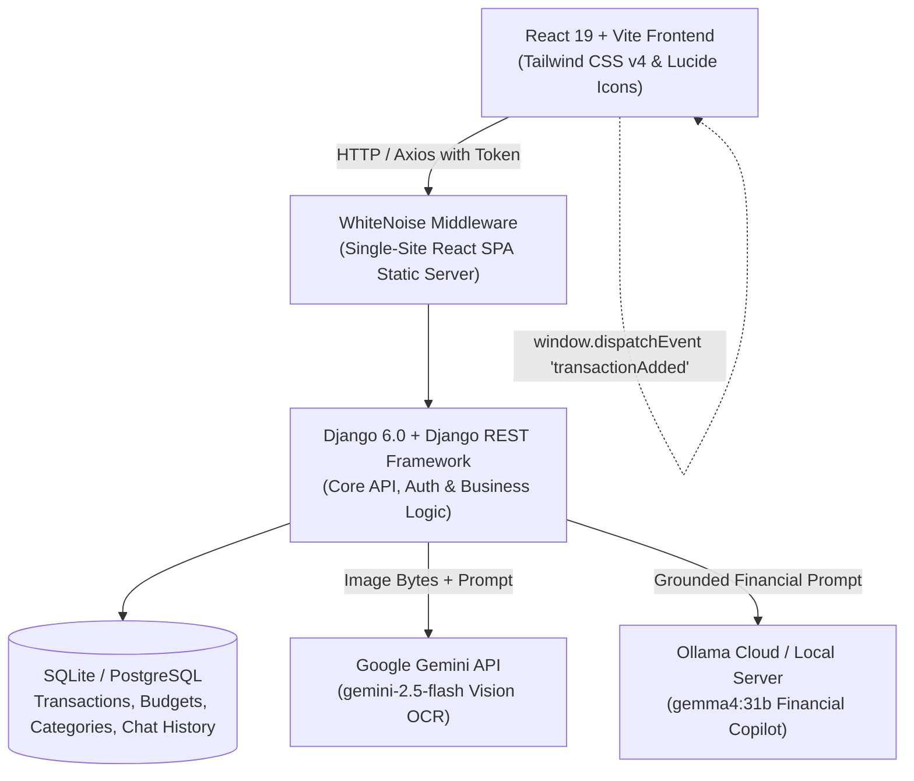
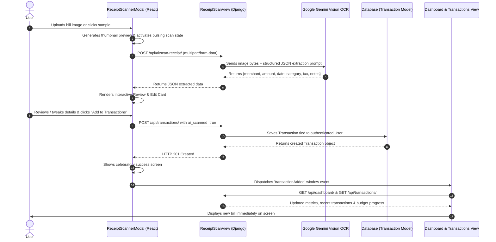
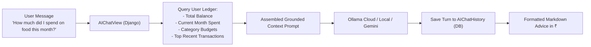
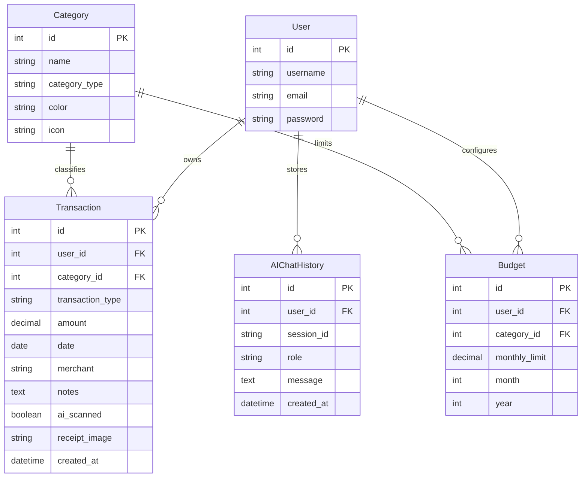

# 📘 ExpenseVision — Complete System Architecture & Working Guide

ExpenseVision is an AI-powered personal financial management and smart expense tracking platform. It bridges human-centric interface design with dual AI capabilities: **Google Gemini Vision OCR** for automated bill/receipt scanning and **Ollama / Gemini** for context-grounded conversational financial intelligence, localized in **Indian Rupees (₹)**.

---

## 📑 Table of Contents
1. [High-Level Architecture](#1-high-level-architecture)
2. [End-to-End Bill & Receipt Scanning Workflow](#2-end-to-end-bill--receipt-scanning-workflow)
3. [AI Financial Copilot & Conversational Chat](#3-ai-financial-copilot--conversational-chat)
4. [Dynamic Budgeting & the 50/30/20 Rule](#4-dynamic-budgeting--the-503020-rule)
5. [Multi-User Private Ledger & Authentication](#5-multi-user-private-ledger--authentication)
6. [Database Schema & Entity Relationship](#6-database-schema--entity-relationship)
7. [REST API Endpoints Reference](#7-rest-api-endpoints-reference)
8. [Local Development & Cloud Deployment](#8-local-development--cloud-deployment)

---

## 1. High-Level Architecture

The platform is designed around a single-site, full-stack decoupled architecture:



### Core Technology Stack
- **Frontend**: React 19, Vite 8, Tailwind CSS v4, Axios, Lucide React, Canvas-Confetti.
- **Backend API**: Django 6.0, Django REST Framework (DRF), WhiteNoise, Gunicorn.
- **Database**: SQLite (default local) / PostgreSQL (production on Render).
- **AI Integrations**:
  - `Google Gemini 2.5 Flash`: Multimodal Vision OCR extraction.
  - `Ollama Cloud / Local`: Gemma 4 open model for financial advisory chat.
  - `Mathematical Simulation Engine`: Resilient fallback ensuring zero downtime.

---

## 2. End-to-End Bill & Receipt Scanning Workflow

### The Problem Solved
Manual expense logging is slow and prone to errors. ExpenseVision enables users to photograph or upload a receipt, invoice, or store bill, and automatically extracts transaction metadata, assigns the correct budget category, and commits it directly to the user's private ledger.

### Detailed Workflow Step-by-Step



### Key Components of Receipt Scanning
1. **Frontend Component** (`frontend/src/components/ReceiptScannerModal.jsx`):
   - **Upload / Drag & Drop Zone**: Accepts PNG, JPG, JPEG, WEBP files with client-side image preview.
   - **Quick-Test Samples**: One-click test fixtures (*Starbucks Coffee*, *DMart Groceries*, *PVR Cinemas*) for instantaneous testing without local images.
   - **Scanning Indicator**: Real-time pulsing feedback while OCR executes.
   - **Verification & Review Card**: Allows user to verify merchant, amount in ₹, category, date, and items before saving.
   - **Auto-Save Toggle**: Optional checkbox to save immediately upon scanning without manual review.
   - **Reactive Sync**: Dispatches `window.dispatchEvent(new CustomEvent('transactionAdded', { detail: tx }))` so the Dashboard and Transactions views refresh immediately.

2. **Backend Vision Handler** (`backend/core/views.py` & `backend/core/ai_services.py`):
   - `ReceiptScanView`: Handles multipart file uploads. Supports optional `auto_save=true` parameter.
   - `GoogleGeminiService.scan_receipt`:
     - Reads image bytes and safely rewinds the file stream (`image_file.seek(0)`).
     - Sends multimodal parts to `gemini-2.5-flash` (with automatic fallback to `gemini-2.0-flash` and `gemini-1.5-flash`).
     - Extracts: `merchant`, `amount`, `date` (defaults to current date), `category`, `tax`, and `notes`.
     - Intelligently maps extracted vendor to standard budget categories.

---

## 3. AI Financial Copilot & Conversational Chat

### Architectural Overview
ExpenseVision provides an intelligent financial advisor accessible via the sidebar and topbar (`AICopilotDrawer.jsx`). Unlike generic AI chatbots, the advisor is **grounded in the user's real database ledger**.



### Key Features
1. **User Context Isolation**:
   - The AI only reads transactions and budgets belonging to the authenticated user (`user=request.user`).
   - Confidentiality is strictly preserved across multi-tenant environments.
2. **Persistent Chat History**:
   - Chat conversations are stored in the database model `AIChatHistory` (`session_id`, `role`, `message`, `user`).
   - Conversations persist across sign-outs and re-authentications.
   - Users can clear their chat history at any time using the "Clear History" button (`DELETE /api/ai/chat/history/`).
3. **Dual Model Support**:
   - **Ollama Cloud / Local**: Calls `https://ollama.com/api/chat` using `OLLAMA_API_KEY` or `http://localhost:11434` with open model `gemma4:31b`.
   - **Google Gemini Fallback**: Seamless fallback if Ollama host is unreachable.
   - **Grounded Math Engine**: Pure calculation engine ensuring accurate totals even if external APIs are offline.

---

## 4. Dynamic Budgeting & the 50/30/20 Rule

ExpenseVision classifies spending into standardized canonical categories and enables automated budget planning.

### Canonical Categories
| Category | Type | Color | Default Icon |
| :--- | :--- | :--- | :--- |
| **Housing** | Needs | `#0ea5e9` (Cyan) | Home |
| **Food & Drinks** | Wants | `#3b82f6` (Blue) | Coffee |
| **Bills & Utilities** | Needs | `#10b981` (Emerald) | Zap |
| **Transportation** | Needs | `#6366f1` (Indigo) | Car |
| **Shopping** | Wants | `#f59e0b` (Amber) | ShoppingBag |
| **Entertainment** | Wants | `#ec4899` (Pink) | Film |
| **Health & Wellness** | Needs | `#14b8a6` (Teal) | HeartPulse |
| **Groceries** | Needs | `#84cc16` (Lime) | ShoppingCart |
| **Income** | Income | `#8b5cf6` (Purple) | Briefcase |

### The 50/30/20 Smart Allocation Engine
Users can set a target monthly budget in `Budgets.jsx`. The system auto-calculates recommended limits:
- **50% Needs**: Housing (25%), Bills & Utilities (10%), Transportation (10%), Health (5%).
- **30% Wants**: Food & Dining (15%), Shopping (10%), Entertainment (5%).
- **20% Savings**: Net balance retention target.

### Real-Time Budget Recalculation
- When a transaction is added (manually or via receipt scan), `BudgetSerializer` computes:
  - `spent`: Sum of all expenses for the category in the selected month & year.
  - `remaining`: `monthly_limit - spent`.
  - `percentage`: `round((spent / monthly_limit) * 100)`.
  - `is_over_budget`: `spent > monthly_limit`.
- Progress bars visually reflect health:
  - `< 70%`: Emerald / normal progress.
  - `70% - 100%`: Amber / warning zone.
  - `> 100%`: Rose / over-budget alert.

---

## 5. Multi-User Private Ledger & Authentication

### Design Philosophy
The authentication interface uses an editorial split-screen design (`frontend/src/pages/Login.jsx`):
- **Warm Editorial Left Panel**: Soft pill-shaped inputs, password visibility toggle, honey-yellow submit button, and social options.
- **Editorial Studio Visual**: Editorial photography with floating frosted glass calendar and meeting badges.
- **Zero AI Generic Jargon**: Crafted for an authentic, human feel.

### Security Implementation
- **Django Token Authentication**: Tokens generated upon login/registration and stored in browser `localStorage`.
- **Automatic Axios Interceptor**: Automatically attaches `Authorization: Token <token>` header to all backend API calls.
- **Case-Insensitive Username Resolution**: Allows `Hardik`, `hardik`, or registered email interchangeably.
- **Session Protection**: All queries are filtered through `Transaction.objects.filter(user=request.user)`.

---

## 6. Database Schema & Entity Relationship



---

## 7. REST API Endpoints Reference

| Method | Endpoint | Description | Auth Required |
| :--- | :--- | :--- | :--- |
| `POST` | `/api/auth/register/` | Register new user account | No |
| `POST` | `/api/auth/login/` | Sign in with username/email & password | No |
| `GET` | `/api/auth/me/` | Fetch authenticated user profile | Yes |
| `POST` | `/api/auth/logout/` | Sign out and invalidate token | Yes |
| `GET` | `/api/dashboard/` | Full dashboard metrics, analytics, recent transactions & budgets | Optional / Yes |
| `GET`, `POST` | `/api/transactions/` | List or create transactions (supports multipart receipt upload) | Optional / Yes |
| `DELETE` | `/api/transactions/:id/` | Delete an existing transaction | Yes |
| `GET`, `POST` | `/api/budgets/` | List or configure category budgets | Optional / Yes |
| `POST` | `/api/budgets/set-total/` | Auto-distribute total monthly budget across categories | Optional / Yes |
| `POST` | `/api/ai/scan-receipt/` | OCR scan receipt/bill via Gemini Vision (optional auto_save) | Optional / Yes |
| `POST` | `/api/ai/chat/` | Conversational financial copilot with ledger context | Optional / Yes |
| `GET`, `DELETE`| `/api/ai/chat/history/` | Fetch or clear user's AI chat history | Optional / Yes |

---

## 8. Local Development & Cloud Deployment

### Running Locally

1. **Start the Django Backend**:
   ```powershell
   cd backend
   # Activate virtual environment
   .venv\Scripts\activate
   # Apply migrations
   python manage.py migrate
   # Run development server (Port 8000)
   python manage.py runserver 8000
   ```

2. **Start the React Frontend**:
   ```powershell
   cd frontend
   npm install
   # Run Vite development server (Port 3000)
   npm run dev
   ```

3. **Open the Application**:
   - Access at `http://localhost:3000` (proxied to port 8000).
   - Sign in with demo credentials: `hardik` / `admin123` or register a new account.

---

### Cloud Deployment on Render

ExpenseVision is configured for seamless deployment to Render via `render.yaml` and `backend/build.sh`:

1. **Build Process** (`backend/build.sh`):
   - Compiles the React production bundle (`cd ../frontend && npm install && npm run build`).
   - Installs backend Python dependencies (`pip install -r requirements.txt`).
   - Copies Vite assets to Django `staticfiles` using `collectstatic`.
   - Runs database migrations (`python manage.py migrate`).
2. **Runtime Serving**:
   - WhiteNoise serves the single-page application and static assets directly from `frontend/dist`.
   - Gunicorn runs the Django WSGI application on the root web service.
3. **Auto-Deploy**:
   - Pushing commits to GitHub `origin/main` automatically triggers Render builds.

---

*ExpenseVision &bull; Engineered with React 19, Django 6.0 & Google Gemini AI*
