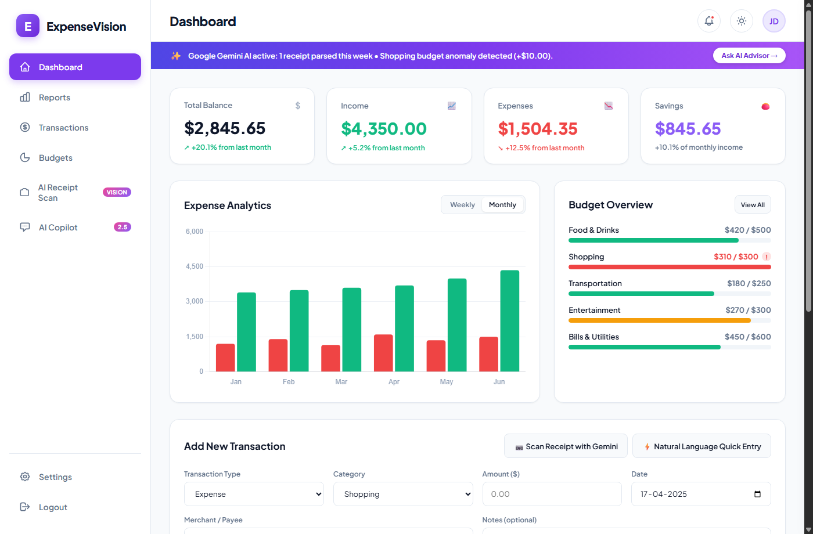
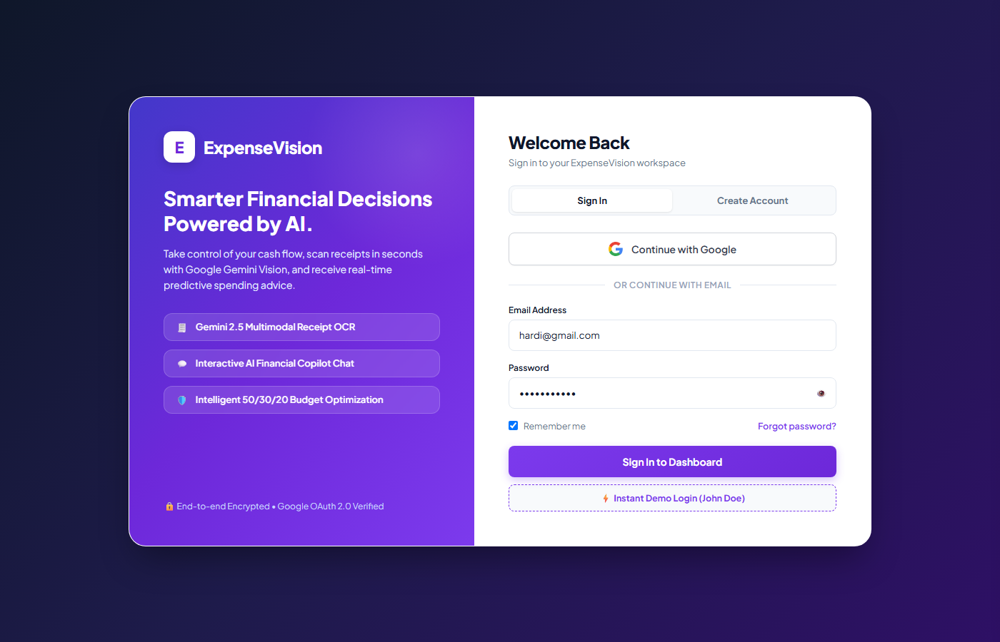

# 💸 ExpenseVision — AI-Powered Personal Finance & Expense Manager

<p align="center">
  
</p>

<p align="center">
  <strong>Intelligent personal finance platform powered by Google Gemini AI — featuring automated receipt vision OCR, multi-user private ledgers, 50/30/20 smart budget allocation, and live conversational financial analytics.</strong>
</p>

<p align="center">
  <a href="https://github.com/thehardik26/ExpenseVision/stargazers"></a>
  <a href="https://github.com/thehardik26/ExpenseVision/network/members"></a>
  <a href="https://github.com/thehardik26/ExpenseVision/blob/main/LICENSE"></a>
  
  
  
  
  
</p>

---

## 🌟 Key Highlights

- **⚡ Real-Time Live Dashboard**: Instant visibility into **Total Balance**, **Monthly Income**, **Expenses**, and **Net Savings** localized in Indian Rupees (`₹`).
- **🤖 Grounded AI Financial Copilot**: Chat with an AI assistant that dynamically analyzes your actual ledger, recent expenses, and budget utilization in real time.
- **📷 Gemini Vision OCR Receipt Scanner**: Take or upload a picture of any invoice/bill, and let Gemini 2.5 Flash automatically extract merchant, amount, category, and date.
- **📊 50/30/20 Smart Budget Allocator**: One-click allocation of an overall monthly budget into Essential Needs, Discretionary Wants, and Savings Goals with live progress indicators.
- **🔒 Multi-User Private Ledgers**: Complete user isolation with Django authentication, case-insensitive logins, and secure database sandboxing.
- **📅 Real-Time Calendar Date Sync**: Dynamic dates anchored to current calendar day, month, and year across all rolling analytics.

---

## 📸 Interface Preview

| Financial Dashboard | Secure Authentication |
| :---: | :---: |
|  |  |

---

## 🛠️ Architecture & Tech Stack

```
ExpenseVision/
├── frontend/             # React 19 + Vite SPA (Port 3000)
│   ├── src/
│   │   ├── components/   # MetricCard, ExpenseChart, TransactionForm, AIChatModal, ReceiptScanner
│   │   ├── pages/        # Dashboard, Budgets, Reports, Transactions, Login, Register
│   │   └── App.jsx       # Layout, topbar with live date, and routing
└── backend/              # Django 6 + Django REST Framework API (Port 8000)
    ├── core/             # Auth views, transaction endpoints, budget calculations, AI services
    └── expensevision/    # Settings, authentication middleware, and URL routes
```

### Technology Breakdown

| Component | Technology | Purpose |
| :--- | :--- | :--- |
| **Frontend Framework** | React 19 + Vite | High-performance single page application |
| **Styling** | Tailwind CSS v4 | Modern glassmorphism & responsive layout |
| **Icons** | Lucide React | Crisp, accessible vector icons |
| **Backend Framework** | Django 6.0 + DRF | Robust RESTful API and relational data modeling |
| **Authentication** | Django Auth + Session/Token | Secure multi-user login and Django Admin integration |
| **Database** | SQLite / PostgreSQL | ACID-compliant transaction and budget records |
| **AI Vision & Chat** | Google Gemini 2.5 Flash | Receipt parsing OCR and conversational finance copilot |
| **Currency** | Indian Rupee (`₹`) | Standardized `en-IN` financial formatting |

---

## 🚀 Quick Start Guide

### Prerequisites
* **Node.js** (v18.0 or newer)
* **Python** (v3.10, v3.11, or v3.12+)
* **Google Gemini API Key** ([Get one for free at Google AI Studio](https://aistudio.google.com/))

---

### 1. Clone the Repository
```bash
git clone https://github.com/thehardik26/ExpenseVision.git
cd ExpenseVision
```

---

### 2. Backend Setup (Django API)

1. Navigate to the backend directory and set up a virtual environment:
   ```bash
   cd backend
   python -m venv .venv
   ```

2. Activate the virtual environment:
   * **Windows (PowerShell)**:
     ```powershell
     .venv\Scripts\Activate.ps1
     ```
   * **macOS / Linux**:
     ```bash
     source .venv/bin/activate
     ```

3. Install Python dependencies:
   ```bash
   pip install -r ../requirement.txt
   ```

4. Configure environment variables in `backend/.env`:
   ```env
   SECRET_KEY=django-insecure-your-secret-key-here
   DEBUG=True
   GEMINI_API_KEY=your_gemini_api_key_here
   ```

5. Run database migrations:
   ```bash
   python manage.py migrate
   ```

6. *(Optional)* Create a Django superuser for admin access:
   ```bash
   python manage.py createsuperuser
   ```

7. Start the Django API server:
   ```bash
   python manage.py runserver 127.0.0.1:8000
   ```

---

### 3. Frontend Setup (React + Vite)

1. Open a new terminal and navigate to the `frontend/` folder:
   ```bash
   cd frontend
   ```

2. Install npm dependencies:
   ```bash
   npm install
   ```

3. Start the Vite development server:
   ```bash
   npm run dev
   ```

4. Open your browser and navigate to:
   * **Web Application**: [http://localhost:3000](http://localhost:3000)
   * **Backend API Root**: [http://127.0.0.1:8000/api/](http://127.0.0.1:8000/api/)
   * **Django Admin**: [http://127.0.0.1:8000/admin/](http://127.0.0.1:8000/admin/)

---

## 📡 REST API Reference

| Method | Endpoint | Description | Auth Required |
| :---: | :--- | :--- | :---: |
| `POST` | `/api/auth/register/` | Register a new user account | No |
| `POST` | `/api/auth/login/` | Log in and receive authentication session | No |
| `POST` | `/api/auth/logout/` | End user session | Yes |
| `GET` | `/api/auth/me/` | Current user profile and admin status | Yes |
| `GET` | `/api/dashboard/` | Aggregated KPIs, charts, and budget summary | Yes |
| `GET` / `POST` | `/api/transactions/` | List or create user transactions | Yes |
| `GET` / `POST` | `/api/budgets/` | Category spending limits and tracking | Yes |
| `POST` | `/api/budgets/set_total/` | Allocate total budget via 50/30/20 rule | Yes |
| `GET` | `/api/reports/` | Category distribution & 6-month historical trends | Yes |
| `POST` | `/api/ai/chat/` | Query the Gemini Financial Copilot | Yes |
| `POST` | `/api/ai/scan-receipt/` | Extract receipt data using Gemini Vision | Yes |

---

## 💡 How Financial Calculations Work

### 1. Total Balance
$$	ext{Total Balance} = \sum 	ext{All Income Transactions} - \sum 	ext{All Expense Transactions}$$
* If you log an expense before logging income, your balance will accurately reflect a deficit (e.g. `-₹500.00`).
* Use the **`⚡ + Add ₹50,000 Salary`** button or the **Add New Transaction** form (Type: `Income`) to record your salary and restore a positive balance.

### 2. Monthly Budget vs. Income
* **Budgets** establish category spending caps (e.g. `₹12,000` for Groceries, `₹5,000` for Utilities).
* Budgets do **not** add money to your bank balance; they guide and constrain your expenditures.

---

## 🔐 Security & Best Practices

- **Zero Hardcoded Secrets**: All sensitive API keys and Django secrets reside strictly in `.env` (gitignored).
- **Per-User Scoped Querysets**: All Django database queries strictly filter by `request.user` to prevent cross-account data leaks.
- **CSRF & Token Hardening**: Uses custom session authentication and token headers for frictionless and secure Single-Page Application requests.

---

## 🤝 Contributing

Contributions, issues, and feature requests are welcome!
1. Fork the Project
2. Create your Feature Branch (`git checkout -b feature/AmazingFeature`)
3. Commit your Changes (`git commit -m 'Add some AmazingFeature'`)
4. Push to the Branch (`git push origin feature/AmazingFeature`)
5. Open a Pull Request

---

## 📄 License

Distributed under the **MIT License**. See `LICENSE` for more information.

---

<p align="center">
  Developed with ❤️ by <a href="https://github.com/thehardik26"><strong>Hardik Pamale</strong></a>
</p>
